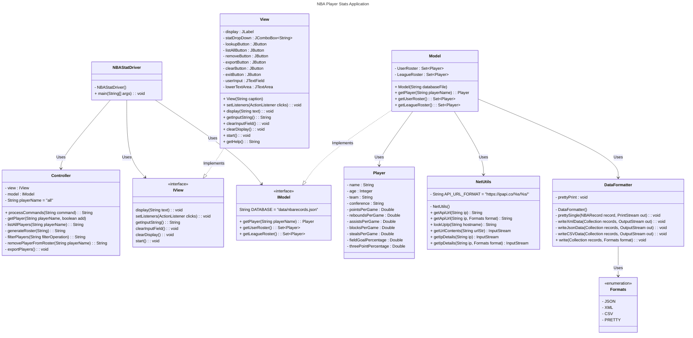

## Initial UML Diagram 

```mermaid
---
title : NBA Player Stats Application
---
classDiagram
    direction TD
    NBAStatDriver --> Controller : Uses
    NBAStatDriver --> IView : Uses
    NBAStatDriver --> IModel : Uses
    View ..|> IView : Implements
    Model ..|> IModel : Implements
    Model --> Player : Uses
    Model --> NetUtils : Uses
    Model --> DataFormatter : Uses 
    DataFormatter --> Formats : Uses

    %% Driver for application
    class NBAStatDriver {
        - NBAStatDriver()
        + main(String[] args) : void
 }
 
     class Controller {
        - view : IView
        - model : IModel
        - String playerName = "all"
        + processCommands(String command) : String
        - getPlayer(String playerName, boolean add)
        - listAllPlayers(String playerName) : String
        - generateRoster(String ) : String
        - filterPlayers(String filterOperation) : String
        - removePlayerFromRoster(String playerName) : String
        - exportPlayers() : void
 }
 
    class IView {
        <<interface>>
        display(String text) : void
        setListeners(ActionListener clicks) : void
        getInputString() : String
        clearInputField() : void
        clearDisplay() : void
        start() : void
 }
 
    class View {
        - display : JLabel
        - statDropDown : JComboBox~String~
        - lookupButton : JButton
        - listAllButton : JButton
        - removeButton : JButton
        - exportButton : JButton
        - clearButton : JButton
        - exitButton : JButton
        - userInput : JTextField
        - lowerTextArea : JTextArea
        
        + View(String caption)
        + setListeners(ActionListener clicks) : void
        + display(String text) : void
        + getInputString() : String
        + clearInputField() : void
        + clearDisplay() : void
        + start() : void
        + getHelp() : String
        
 }
 
    %% Model Package
    
    %% Model interface
    class IModel {
        <<interface>>
        String DATABASE = "data/nbarecords.json"
        
        + getPlayer(String playerName) : Player
        + getUserRoster() : Set~Player~
        + getLeagueRoster() : Set~Player~
 }
 
    %% Model for creating all and saved roster of players
    class Model {
        - UserRoster : Set~Player~
        - LeagueRoster : Set~Player~
        + Model(String databaseFile)
        + getPlayer(String playerName) : Player
        + getUserRoster() : Set~Player~
        + getLeagueRoster() : Set~Player~
 }
 
 
    %% Record class
    class Player {
        - name : String
        - age : Integer
        - team : String
        - conference : String
        - pointsPerGame : Double
        - reboundsPerGame : Double
        - assistsPerGame : Double
        - blocksPerGame : Double
        - stealsPerGame : Double
        - fieldGoalPercentage : Double
        - threePointPercentage : Double
    }
 
    %% Pulls API data
    %% Model/Net package
    class NetUtils {
        - String API_URL_FORMAT = "https://ipapi.co/%s/%s/"
        - NetUtils()
        + getApiUrl(String ip) String
        + getApiUrl(String ip, Formats format) String
        + lookUpIp(String hostname) String
        + getUrlContents(String urlStr) InputStream
        + getIpDetails(String ip) InputStream
        + getIpDetails(String ip, Formats format) InputStream 
        }
 
    %% Formats data pulled from API to Pretty, XML, JSON, CSV
    %% In model package
    class DataFormatter {
        - DataFormatter()
        - prettyPrint : void
        - prettySingle(NBARecord record, PrintStream out) : void
        - writeXmlData(Collection<Player> records, OutputStream out) : void
        - writeJsonData(Collection<Player> records, OutputStream out) : void
        - writeCSVData(Collection<Player> records, OutputStream out) : void
        + write(Collection<Player> records, Formats format) : void
 }
    %% In model package
    class Formats {
        <<enumeration>>
        - JSON
        - XML
        - CSV
        - PRETTY
    }
```